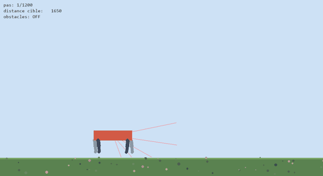
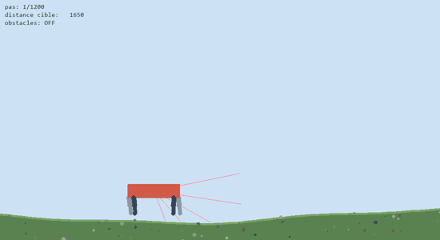

# Un quadrupède qui apprend à marcher (PPO)

Projet personnel (2026) : une créature à quatre pattes, simulée en 2D avec une vraie physique, apprend **par renforcement** à marcher jusqu'à un drapeau, puis sur un terrain ondulé et au milieu d'obstacles.

| Sol plat | Terrain ondulé |
|---|---|
|  |  |

## Environnement

`creature_env.py` construit le monde physique (pymunk, vue de côté avec gravité) : un torse, quatre pattes à hanche et genou motorisés (**8 moteurs**), un sol plat ou ondulé, des obstacles et une cible. `quadruped_env.py` l'enveloppe dans l'interface **Gymnasium**.

| | |
|---|---|
| **Actions** | 8 réels dans [-1, 1] : vitesses des moteurs |
| **Observations** (28) | orientation, vitesses et hauteur du torse ; angle et vitesse de chaque articulation ; distance à la cible ; 5 capteurs de distance (raycasts) |
| **Récompense** | progression vers la cible + bonus de survie − inclinaison − énergie − collisions ; +200 si la cible est atteinte, −10 en cas de chute |
| **Fin d'épisode** | cible atteinte, chute (torse incliné de plus de 90° ou trop bas) ou 1 200 pas |

## Entraînement

PPO de **Stable-Baselines3** :
- environnements parallèles (`SubprocVecEnv`) ;
- normalisation des observations et récompenses (`VecNormalize`) ;
- réseaux 256×256 pour la politique et le critique ;
- checkpoints réguliers et logs TensorBoard.

Un **curriculum** est possible : `--init-from` repart d'un modèle déjà entraîné, par exemple de la marche sur sol plat vers les obstacles. `--watch-every` affiche périodiquement la politique en cours d'entraînement.

## Résultats des modèles fournis

Évaluation déterministe sur 20 épisodes (`models/*_final.zip`) :

| Modèle | Tâche | Cible atteinte | Chutes | Durée moyenne jusqu'à la cible |
|---|---|---:|---:|---:|
| `ppo_quadruped` | sol plat | **20 / 20** | 0 | 5,3 s |
| `terrain_v1` | terrain ondulé | **16 / 20** | 4 | 6,7 s |
| `avec_obstacles` | obstacles (difficulté max) | 0 / 20 | 13 | — |

La marche est acquise sur sol plat et résiste bien au relief. L'évitement d'obstacles n'est pas encore résolu : c'est la prochaine étape.

## Utilisation

```bash
pip install -r requirements.txt

python creature_env.py                         # la physique seule (démo de mouvement)
python watch.py --name ppo_quadruped           # regarder un modèle entraîné
python watch.py --name terrain_v1 --terrain
python train.py --timesteps 1000000 --n-envs 4 # entraîner (sol plat)
python train.py --name obstacles --obstacles --init-from ppo_quadruped
python progression.py --name ppo_quadruped     # après un entraînement : rejouer les checkpoints dans l'ordre
tensorboard --logdir logs                      # courbes d'apprentissage
```

## Stack

Python · pymunk · pygame · Gymnasium · Stable-Baselines3 (PPO) · PyTorch · TensorBoard

## Licence

Code distribué sous [licence MIT](LICENSE).
